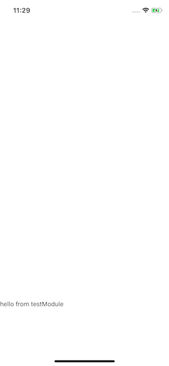
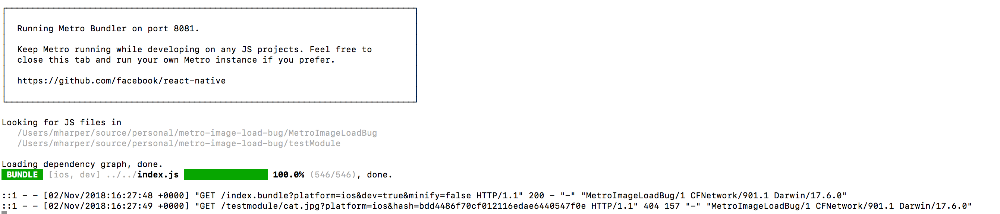

# metro-image-load-bug

Repo to assist in reproducing https://github.com/facebook/metro/issues/289

## Setup

```
  cd ./MetroImageLoadBug
  npm i
  npm run ios
```

Notice: The text from `testmodule` appears on the screen, however the `cat.jpg` does not.



Notice: The bundler shows a 404 when fetching the `cat.jpg` image.

